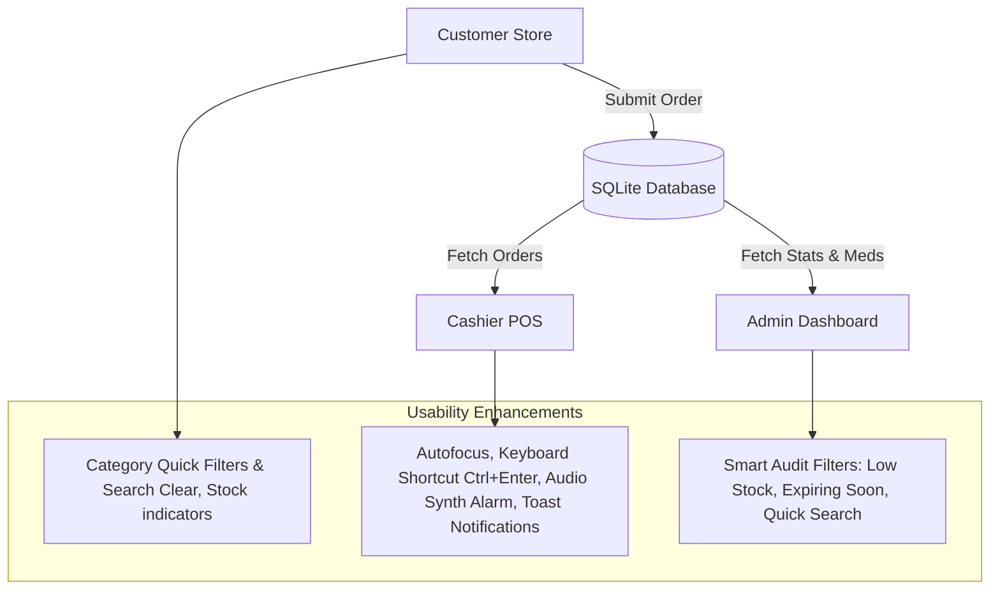

# Walkthrough: MediMart Premium Theme Modes & Usability Upgrades

This walkthrough summarizes the completed theme configurations, light mode visual optimizations, critical layout fixes, and the newly added usability features across the Customer Store, Cashier POS, and Admin Dashboard.

---

## 🎨 System Overview

We have enhanced the user experience across all three portals (Customer, Cashier, and Admin) using client-side JavaScript to minimize load times and eliminate server latency.

---

## 🛠️ Summary of Accomplishments

### 1. Customer Store Usability Enhancements (`public/customer.html`)
* **Category Quick-Filter Badges**:
  * Added a row of horizontal glass buttons above the catalog grid showing all available categories.
  * Clicking a category filters the catalog instantly. The active category is styled with an indigo/blue highlight.
* **Search Clear Action & Empty State**:
  * Added a clear button (×) inside the search input which shows only when text is entered and clears the search in one click.
  * If a search returns no items, a descriptive "No results found matching your filters." state displays with a "Clear Filters" button to reset the catalog.
* **Live Stock Count in Cart**:
  * In the shopping cart drawer, each item shows its remaining stock (e.g. `₹25.00 each | Stock: 15`). This informs the customer of buying limits directly.

### 2. Cashier POS Usability Enhancements (`public/cashier.html`)
* **Autofocus Search**:
  * The medicine search bar is autofocused on page load so cashiers can search and add walk-in items immediately.
* **Keyboard Shortcut for Checkout (`Ctrl+Enter`)**:
  * Cashiers can finalize and save invoices by pressing `Ctrl+Enter` when a cart has items, speeding up checkout.
* **Web Audio Synth Alarm & Dynamic Queue Badge**:
  * The queue header displays the exact count of pending orders (e.g. `Customer Queue (3)`).
  * The queue is polled automatically in the background every 30 seconds.
  * When a new customer order is received, a dual-tone sine wave beep plays using the Web Audio API to alert the cashier.
* **Obsidian-Glass Toast Notifications**:
  * Replaced all native browser alert popups with a beautiful, non-disruptive Toast system matching the dark-obsidian and light-glass theme styles.

### 3. Admin Dashboard Usability Enhancements (`public/admin.html`)
* **Smart Inventory Auditing Toggles**:
  * Added checkboxes above the inventory table to filter items instantly:
    * **Low Stock Only**: Displays only medicines with quantities < 5.
    * **Expiring Soon**: Displays medicines whose expiration date has passed or is within 60 days from today.
  * Added an inline inventory search box to filter medicines instantly in JavaScript by name, category, or ID.
* **Billing History Search Filter**:
  * Added a search input above the transaction log table to filter historical invoices instantly by ID, Customer Username, Email, or Payment Method.

### 4. Landing Page Theme Toggles & Access Portal Responsiveness
* **Exclusive Extraordinary Themes Selector**:
  * Added segmented controls inside the HUD panel (`public/index.html`) to choose from: Default theme, Cyberpunk Glow, Mint Health, or Royal Amethyst.
  * Tied selection state dynamically to LocalStorage (`landing_theme`) and bound active button CSS indicators.
* **Access Portal Theme Compatibility (`public/login.html`, `public/register.html`)**:
  * Enabled full theme-responsiveness for Login and Operator Registry forms to adapt to standard light/dark user settings.
* **Universal Font Contrast Tuning**:
  * Eliminated all custom/non-standard color classes (such as `slate-655`, `indigo-650`, `rose-650`, `slate-450`, etc.) and mapped them to standard, high-contrast Tailwind CSS values.

---

## 🧪 How to Verify Manually

1. **Landing Page Themes**:
   * Open the root landing page (`index.html`). Click the bottom-right HUD button to open the control panel.
   * Under "Exclusive Art Themes", choose Cyberpunk, Mint, or Royal and see the graphics adjust instantly. Reload the page to ensure LocalStorage persists the selection.
   
2. **Access Portals**:
   * Switch the Environment Theme from Dark to Light inside the HUD panel.
   * Navigate to the Login or Register pages and verify the backgrounds, panels, labels, and text inputs render in a readable, premium light theme.

3. **Customer Store**:
   * Open the store dashboard. Try clicking on category badges (like "All", "Antibiotics", etc.) and verify the medicine list updates instantly.
   * Type in the search box. Click the (×) button to reset.
   * Open the Cart drawer and verify that each item displays its price and stock limit.

4. **Cashier POS**:
   * Open the POS page. Verify that the cursor is automatically placed inside the search input.
   * Add a medicine to the cart. Hit `Ctrl+Enter` to verify it saves the invoice and pops a Toast notification instead of a window prompt.
   * Submit an online order from the Customer Store. Wait up to 30 seconds (or click refresh) on the POS page. Verify a notification chime plays and the queue header count increments.

5. **Admin Panel**:
   * Open the admin dashboard.
   * Check **Low Stock Only** and verify only medicines with stock under 5 are displayed.
   * Check **Expiring Soon** and verify only medicines expiring within 60 days are shown.
   * Type a keyword into the Billing History search box and check that matching transactions filter in real-time.
